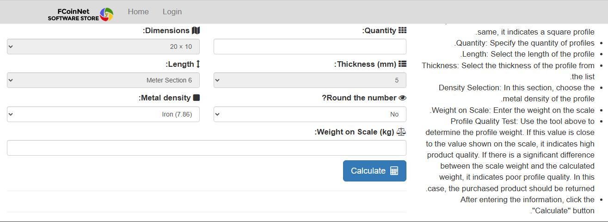
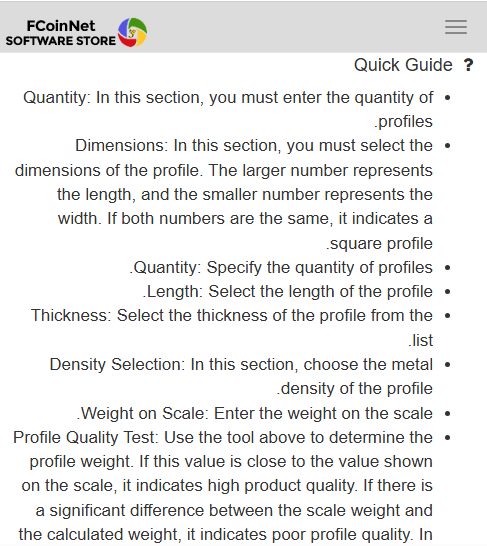
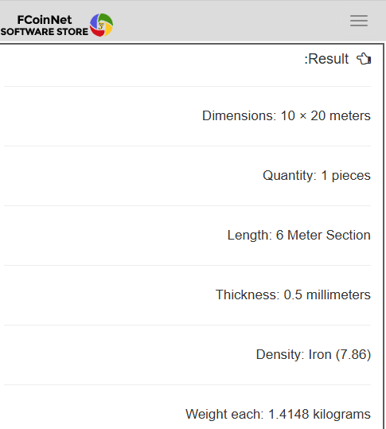

# 🏗️ Metal Profile Weight Calculator

A professional-grade web application for calculating weights of various metal profiles including I-beams, channels, angles, tubes, and more. Perfect for engineers, architects, and metal fabricators.

## 🌐 Live Application

🚀 Instant access - No downloads required  
📊 Accurate calculations - Industry-standard formulas  
🌙 Dark mode supported  

🔗 [Launch Profile Weight Calculator](https://apps.fcoinnet.com/software/2)

## ✨ Key Features

- **Comprehensive Material Library**:
  - Structural Steel (S235, S355)
  - Aluminum Alloys (6061, 6063)
  - Stainless Steel (304, 316)
  
- **Profile Types**:
  - Standard beams (I, H, U profiles)
  - Angles (Equal & Unequal legs)
  - Hollow sections (Square, Rectangular, Circular)
  
- **Advanced Functionality**:
  - Multi-profile calculations
  - Unit converter (kg ↔ lb, mm ↔ inch)
  - Project saving capability

## 📸 Application Gallery

### Desktop Experience
| Main Calculator Interface | Results Overview |
|---------------------------|------------------|
|  |  |

### Mobile Experience
| Mobile Calculator | Material Selection | Results Screen |
|-------------------|--------------------|----------------|
|  |  |  |

> All screenshots reflect actual app functionality across different devices.

## 📊 Sample Calculation

**I-beam Calculation Example**:
- Profile: IPE 200
- Dimensions: 200mm × 100mm × 8mm
- Material: S235JR Steel
- Length: 6 meters
- **Result**: 156.2 kg

## 🛠️ How It Works

1. Select your profile type from the library
2. Enter precise dimensions
3. Choose your material
4. Specify length requirements
5. Get instant weight calculation

