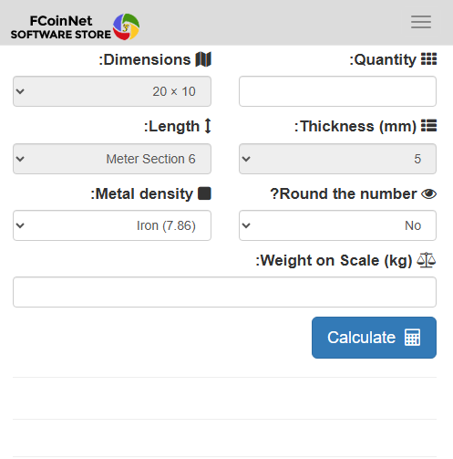

# Profile Weight Calculator Software

A lightweight and efficient web-based application that helps you calculate the weight of different metal profiles such as I-beams, channels, angles, and more.

## 🌐 Access the Web App

✅ Works on all devices: Windows, macOS, Linux, Android, iOS  
👉 [Click here to open the Profile Weight Calculator](https://apps.fcoinnet.com/software/2)

## 🔧 Features
- Calculate weights of steel, aluminum, and other profiles
- Supports metric and imperial units
- No installation required – runs directly in your browser
- Fully responsive on mobile and desktop

## 🖼️ Gallery

### 💻 Desktop View

### 📱 Mobile View

> All screenshots were taken from real devices using the web-based version.

## ❗ License & Source Code

This software is **not open-source**. Redistribution, copying, or modification of this service is not permitted without explicit permission.

## 📧 Contact

For support, inquiries, or feedback, please contact:  
📩 [info@fcoinnet.com](mailto:info@fcoinnet.com)
